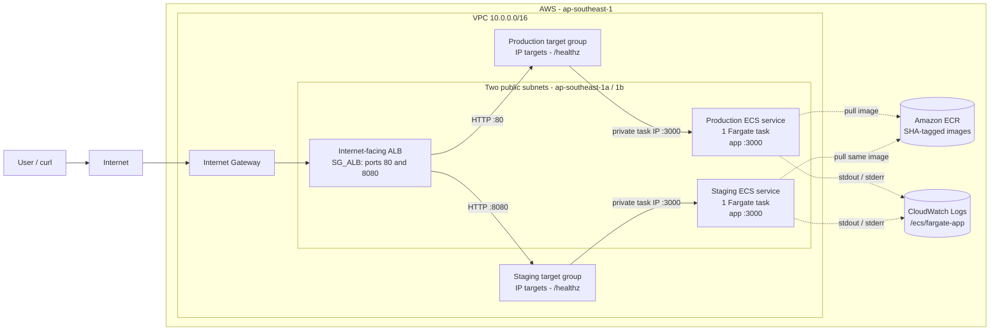
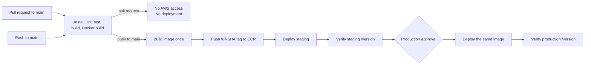
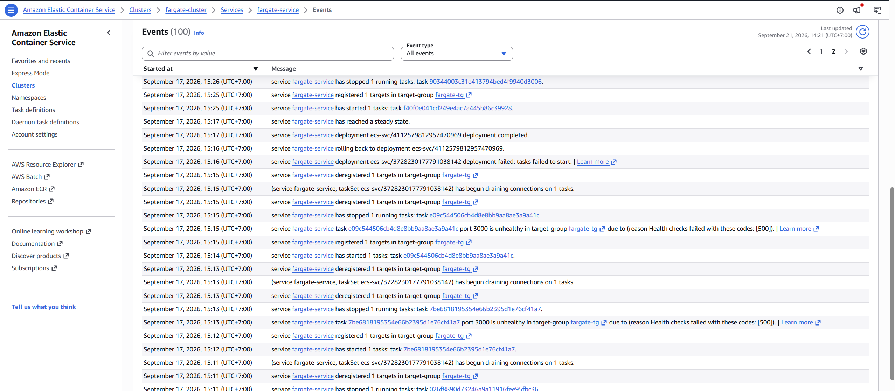

# CI/CD Pipeline on AWS ECS Fargate

A portfolio project that demonstrates a production-style CI/CD pipeline for a small Node.js application. GitHub Actions tests the code, builds one Docker image, pushes it to Amazon ECR with an immutable commit SHA tag, deploys it automatically to staging, and waits for approval before promoting the same image to production.

The project also demonstrates least-privilege AWS access with GitHub OIDC, zero-downtime ECS deployments, automatic rollback with the ECS deployment circuit breaker, and a verified manual rollback workflow.

## Highlights

- TypeScript and Express application with `/healthz` and `/version` endpoints.
- Multi-stage Docker image running as the non-root `node` user.
- GitHub OIDC authentication with no long-lived AWS keys.
- Separate least-privilege roles for CI, staging deployment, and production deployment.
- Docker images tagged with the full Git commit SHA instead of `latest`.
- One image is built once, tested in staging, and promoted unchanged to production.
- Production deployments and rollbacks require GitHub Environment approval.
- Automatic and manual rollback paths both verify the running commit.

## Architecture



The ALB spans both public subnets. Each ECS service has a desired count of one, and ECS may place its task in either subnet. With `awsvpc` networking, every task receives its own network interface and private IP, so both target groups use `target-type: ip`.

The ALB forwards traffic to the task's **private IP** on port `3000`. The task security group accepts port `3000` only when the source is the ALB security group. A task also receives a public IP for outbound access to ECR and CloudWatch because this cost-optimized design has no NAT Gateway; that public IP does not make port `3000` directly reachable from a laptop.

Request path:

```text
Client -> ALB DNS -> Internet Gateway -> ALB listener
       -> target group -> task private IP:3000 -> Node/Express route
```

Production uses listener port `80`; staging uses port `8080` on the same ALB.

## Pipeline



### Pull requests

Pull requests run `npm ci`, lint, tests, TypeScript compilation, and a Docker build. They do not receive AWS credentials and cannot push an image or deploy a service.

### Pushes to main

1. The test job must pass.
2. The CI job assumes the ECR-only role through GitHub OIDC.
3. Docker builds one image with `GIT_COMMIT=${{ github.sha }}` and tags it with the full SHA.
4. The image is pushed to the project ECR repository.
5. Staging registers a new `fargate-app-staging` task-definition revision and deploys automatically.
6. The workflow checks that staging `/version` returns the expected commit.
7. The production job waits for approval in the `production` GitHub Environment.
8. Production registers a new `fargate-app` revision and deploys the **same ECR image**.
9. The final check compares the production `/version` commit with the pushed SHA.

The deploy jobs render `task-definition.json` with `jq`, register an immutable task-definition revision, update the ECS service, wait for the service to stabilize, and verify the running commit.

Documentation-only changes are excluded from the main pipeline through `paths-ignore`.

## Rollback

### Automatic rollback

The application includes a repeatable failure switch: setting `FAIL_HEALTHCHECK=true` makes `/healthz` return HTTP `500` while the Node process remains running.

During the rollback demonstration:

1. ECS started a replacement task.
2. The ALB health check received HTTP `500` and marked it unhealthy.
3. ECS stopped the unhealthy task and retried.
4. After three failed replacement tasks, the deployment circuit breaker marked the deployment as failed.
5. ECS automatically restored the last successfully completed deployment.
6. `aws ecs wait services-stable` returned successfully because the rollback made the service stable again.
7. The workflow still failed because `/version` returned the old commit instead of the commit that triggered the deployment.

The final SHA comparison is important: a stable service only proves that _something_ is healthy. It does not prove that the requested release was deployed.

### Manual rollback

The [manual rollback workflow](.github/workflows/rollback.yml) is started with `workflow_dispatch` and accepts:

- `environment`: `staging` or `production`
- `revision`: an existing task-definition revision number
- `reason`: an optional audit message

The workflow validates that the revision is active, prints its image and environment configuration, updates the selected service without rebuilding anything, waits for stability, and verifies both the task-definition ARN and the commit returned by `/version`. A production rollback uses the `production` environment, so it requires the same approval as a normal production deployment.

## Security and IAM

| Identity                | Trusted GitHub context   | Main permission                                 |
| ----------------------- | ------------------------ | ----------------------------------------------- |
| CI role                 | `main` branch            | Push only to the project ECR repository         |
| Staging deploy role     | `environment:staging`    | Update only `fargate-service-staging`           |
| Production deploy role  | `environment:production` | Update only `fargate-service`                   |
| ECS task execution role | ECS tasks service        | Pull from ECR and write CloudWatch logs         |
| ECS task role           | ECS tasks service        | Empty because the application calls no AWS APIs |

The deploy roles may pass only the two project task roles, and only to `ecs-tasks.amazonaws.com`. This prevents a workflow from attaching arbitrary IAM roles to a task definition.

The OIDC trust policies use exact `sub` claims rather than a repository-wide wildcard. Therefore, a staging job cannot assume the production role, even if someone adds a production command to the staging workflow.

## Design decisions

| Decision                                          | Reason                                                                    | Trade-off                                                                            |
| ------------------------------------------------- | ------------------------------------------------------------------------- | ------------------------------------------------------------------------------------ |
| Full commit SHA image tags                        | Immutable releases, clear traceability, and exact rollback targets        | Tags are long and need lifecycle management                                          |
| Build once, promote the same image                | Production runs the exact bytes tested in staging                         | Environment-specific behavior must come from runtime configuration                   |
| GitHub OIDC                                       | Temporary credentials; no AWS access keys stored in GitHub                | Requires careful trust-policy conditions                                             |
| Separate CI, staging, and production roles        | Enforces least privilege in AWS, not only in workflow YAML                | More IAM resources to maintain                                                       |
| `awsvpc` with IP target groups                    | Each Fargate task has its own ENI and private IP                          | Requires VPC and security-group planning                                             |
| Public task IPs and no NAT Gateway                | Keeps a small portfolio environment simpler and avoids NAT hourly charges | Private subnets or VPC endpoints would be preferred for a stricter production design |
| Shared ALB with ports `80` and `8080`             | Avoids paying for a second load balancer                                  | Hostname routing and HTTPS would be cleaner for a real system                        |
| `minimumHealthyPercent=100`, `maximumPercent=200` | Starts the new task before stopping the old one                           | A deployment briefly runs extra Fargate capacity                                     |
| Separate task-definition families                 | Staging and production revisions cannot be confused                       | Two revision histories must be managed                                               |
| Seven-day log retention                           | Keeps enough demo history without storing logs forever                    | Older logs are deleted                                                               |

## Run locally

Requirements: Node.js 22 or newer and Docker.

```bash
npm ci
npm run lint
npm test
npm run build
npm start
```

Test the application:

```bash
curl http://localhost:3000/healthz
curl http://localhost:3000/version
```

Build and run the container with release metadata:

```bash
docker build \
  --build-arg APP_VERSION=local \
  --build-arg GIT_COMMIT=$(git rev-parse HEAD) \
  -t fargate-app:local .

docker run --rm -p 3000:3000 fargate-app:local
```

The runtime image uses `node:22-slim`, runs as the non-root `node` user, and starts Node with exec-form `CMD` so the process receives ECS `SIGTERM` directly and can shut down gracefully.

## Cost

Example estimate for `ap-southeast-1`, assuming 730 hours per month and both services running continuously. Prices were checked in September 2026 and may change.

| Resource                                    | Assumption                                                                | Approximate monthly cost |
| ------------------------------------------- | ------------------------------------------------------------------------- | -----------------------: |
| ECS Fargate                                 | Two tasks, each `0.25 vCPU` and `0.5 GB`                                  |                 `$22.49` |
| Application Load Balancer                   | One ALB at `$0.0252/hour`                                                 |                 `$18.40` |
| Public IPv4                                 | Typically two ALB addresses plus two task addresses at `$0.005/hour` each |                 `$14.60` |
| ALB LCU, ECR, CloudWatch, and data transfer | Usage-based; small for demo traffic                                       |                 Variable |
| **Estimated base total**                    | Before usage-based charges and taxes                                      | **About `$55.50/month`** |

The VPC, subnets, route tables, security groups, IAM roles, ECS cluster, and task-definition registrations do not add a standalone hourly charge. This design intentionally avoids a NAT Gateway, which would add hourly and data-processing costs.

Pricing references: [AWS Fargate](https://aws.amazon.com/fargate/pricing/), [Elastic Load Balancing](https://aws.amazon.com/elasticloadbalancing/pricing/), [public IPv4](https://aws.amazon.com/vpc/pricing/), [Amazon ECR](https://aws.amazon.com/ecr/pricing/), and [CloudWatch](https://aws.amazon.com/cloudwatch/pricing/).

To pause the project, scaling both services to zero stops Fargate task charges and their task public IPv4 charges, but the ALB and its public IPv4 addresses continue billing until the ALB is deleted.

## Evidence

### ECS circuit breaker rollback



The events show repeated `Health checks failed with these codes: [500]`, the failed deployment, automatic rollback to the previous deployment, and the service returning to a steady state.

- [Raw ECS circuit breaker events](docs/ecs-circuit-breaker-events.txt)
- [GitHub Actions runs](https://github.com/mqcuong1603/ci-cd-pipeline-ecs-fargate/actions)
- [Main pipeline workflow](.github/workflows/pipeline.yml)
- [Manual rollback workflow](.github/workflows/rollback.yml)
- [IAM policies and trust policies](infra/iam/)

## What I would do next

- Add HTTPS with ACM and Route 53, then use hostname-based routing instead of public ports `80` and `8080`.
- Define the infrastructure with Terraform or AWS CDK instead of manual CLI commands.
- Move tasks to private subnets and compare NAT Gateway costs with ECR, CloudWatch, and S3 VPC endpoints.
- Run at least two production tasks and add ECS Service Auto Scaling.
- Add CloudWatch alarms for unhealthy hosts, deployment failures, latency, and HTTP `5xx` responses.
- Store runtime secrets in AWS Secrets Manager or Systems Manager Parameter Store.
- Add dependency, container-image, and static-security scanning to CI.
  I would do next
